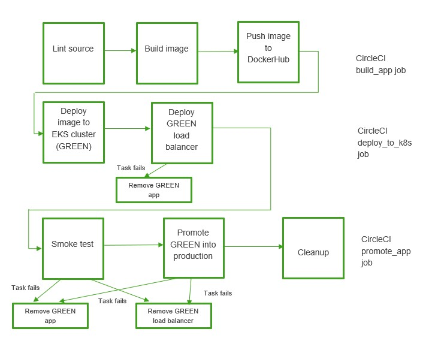

## Cloud DevOps Engineer capstone project

### Project introduction

This Udacity project operationalize a simple Python/flask app which will return the status and the version of it in json format. It uses CircleCI and Kubernetes cluster in AWS EKS (Amazon elastic kubernetes service)

- We use CircleCI 
  - To lint and build the app image after code commit
  - The image is pushed into DockerHub
  - Promote to production if app passes smoke test. We use blue-green deployment strategy for promotion

The CircleCI jobs and tasks pipeline can be visualized in the following picture

The blue-green deployment is described in the following picture

 

### Environment setup

1. The following environment variables must be setup in CircleCI

- AWS_ACCESS_KEY_ID
- AWS_DEFAULT_REGION
- AWS_SECRET_ACCESS_KEY
- DOCKER_LOGIN
- DOCKER_PASSWORD
- KUBECONFIG_DATA			

2. Manually create Kubernetes cluster in AWS EKS using the script 'bin/create_cluster.sh'
3. Deploy blue app and blue load balancer using the script 'bin/setup_first_k8s_app.sh'

The step in 1 prepares the CircleCI environment so a code commit to github will trigger CircleCI to build and image and deploy to AWS EKS

The step in 2, 3 will setup the blue environment

### Operationalize the app

1. Perform code change
2. Modify the CURRENT, LAST in config.txt. CURRENT represents the version going to be released. LAST represents the previous version of the app with respect to this release (ie CURRENT)
3. Commit to github

### Project files description

- Makefile: contains command to prepare the virtual environment, install dependencies and lint the build files
- app.py: the simple Flask app
- Dockerfile: contains instructions on how to containerized the microservice
- requirements.txt: dependencies for app.py
- config.txt: contains variables for the app
- bin/build_docker.sh: build the image of CURRENT version of app
- bin/build_push_first_docker.sh: build the blue environment
- bin/create_cluster.sh: create the EKS k8s cluster
- bin/del_green_lb.sh: delete the green load balancer
- bin/del_last_app.sh: delete the LAST version of app in k8s cluster
- bin/deploy_green_app.sh: deploy the CURRENT version of app in k8s cluster (GREEN candidate)
- bin/get_k8s.sh: get the base64 string of the k8s cluster configuration. Setup KUBECONFIG_DATA in CircleCI
- bin/promote_app.sh: promote the CURRENT version of app (CREEN candidate) to Production 
- bin/push_docker.sh: push the CURRENT version of app (GREEN candidate) image to DockerHub
- bin/setup_first_k8s_app.sh: setup the BLUE environment